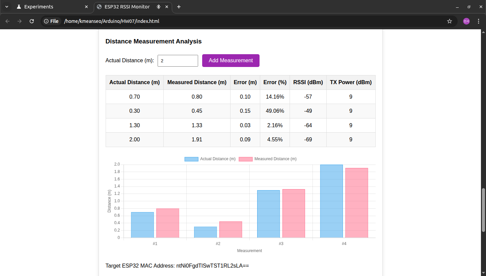
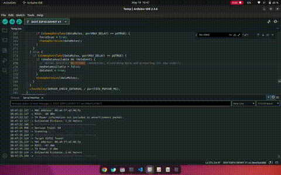

# IoT25-HW07: BLE-Based Distance Estimation with ESP32

This project demonstrates how to estimate distance between two ESP32 boards using Bluetooth Low Energy (BLE) signal strength (RSSI). One ESP32 acts as a BLE **Advertiser (Server)** and the other as a **Scanner (Client)** that reads RSSI values and estimates the distance using a path loss model. Additionally, the estimated distances are logged and visualized.

---

## 🧾 Objectives

- Establish BLE advertisement between two ESP32 boards
- Scan and measure RSSI signal strength from the advertiser
- Estimate physical distance using RSSI and TX power values
- Display distance and status via serial monitor and RGB LED
- Record multiple distance measurements for different positions
- Visualize results with graphs and tables

---

## 🧰 Components

- 2× ESP32 DevKit v1 boards  
- RGB LED (connected to GPIO 25, 26, 27)  
- Jumper wires  
- Breadboard  
- Laptop (for Arduino IDE and visualization)

---

## 💡 Overview

- **BLE Server (`IoT25_HW07_server.ino`)**
  - Initializes BLE advertising with custom service UUID
  - No connection required, just advertises presence
  - Advertiser name: `ESP32_Advertiser`

- **BLE Client (`IoT25_HW07_client.ino`)**
  - Scans for BLE devices matching a target MAC address
  - Reads RSSI values of the advertisement packets
  - Estimates distance using the log-distance path loss model:
    ```
    distance = 10 ^ ((txPower - RSSI) / (10 * n))
    ```
    where `txPower` is assumed, and `n` is environmental factor
  - Displays status via RGB LED (color-coded by distance)
  - Logs distance to serial monitor

---

## 📄 Code Summary

- **Client Code**
```cpp
#include <BLEDevice.h>
#include <BLEUtils.h>
#include <BLEScan.h>
#include <BLEAdvertisedDevice.h>
#include <BLEServer.h>
#include <Arduino.h>

// Service and characteristic UUIDs
#define SERVICE_UUID        "4fafc201-1fb5-459e-8fcc-c5c9c331914b"
#define CHARACTERISTIC_UUID "beb5483e-36e1-4688-b7f5-ea07361b26a8"

// Target MAC address to scan for (format: AA:BB:CC:DD:EE:FF)
String targetMacAddress = "08:a6:f7:a1:46:fa"; // Replace with your target ESP32 MAC address

// Timing settings
#define SCAN_DURATION 3         // BLE scan duration in seconds – shorter for frequent scans
#define SCAN_INTERVAL 100       // Scan interval in milliseconds
#define SCAN_WINDOW 99          // Scan window in milliseconds
#define SERVER_CHECK_INTERVAL 100 // BLE server task checking interval in milliseconds
#define CONNECTION_TIMEOUT 10000  // BLE connection timeout in milliseconds

// RGB LED pins
#define RED_PIN    25  // GPIO pin for red LED
#define GREEN_PIN  26  // GPIO pin for green LED
#define BLUE_PIN   27  // GPIO pin for blue LED

// BLE scanner variables
BLEScan* pBLEScan;
bool deviceFound = false;

// BLE server variables
BLEServer *pServer = NULL;
BLECharacteristic *pCharacteristic = NULL;
bool deviceConnected = false;
unsigned long lastClientActivity = 0;  // Last activity timestamp from BLE client

// Device name variable
String bleDeviceName = "ESP32_RSSI_Server";

// Shared data variables
int rssiValue = 0;
int txPower = 0;
bool newDataAvailable = false;
bool dataSent = true;  // Initially true to allow first scan
SemaphoreHandle_t dataMutex; // Mutex for synchronizing data access

// RGB LED current state variables
int currentRed = 0;
int currentGreen = 0;
int currentBlue = 0;

// Flag to force BLE scan after RGB command
bool forceScan = false;

// Function to update BLE device name
void updateBLEDeviceName(const char* newName) {
  // Set new name
  esp_ble_gap_set_device_name(newName);

  // Stop advertising
  BLEDevice::stopAdvertising();

  // Update advertising data
  BLEAdvertising *pAdvertising = BLEDevice::getAdvertising();
  pAdvertising->addServiceUUID(SERVICE_UUID);
  pAdvertising->setScanResponse(true);
  pAdvertising->setMinPreferred(0x06);
  pAdvertising->setMinPreferred(0x12);

  // Restart advertising
  BLEDevice::startAdvertising();

  Serial.print("BLE device name changed to: ");
  Serial.println(newName);
}

void setColor(int red, int green, int blue) {
  analogWrite(RED_PIN, 255 - red);
  analogWrite(GREEN_PIN, 255 - green);
  analogWrite(BLUE_PIN, 255 - blue);

  currentRed = red;
  currentGreen = green;
  currentBlue = blue;

  Serial.printf("RGB LED set to: R=%d, G=%d, B=%d\n", red, green, blue);
}

// BLE connection callback class
class MyServerCallbacks: public BLEServerCallbacks {
  void onConnect(BLEServer* pServer) {
    deviceConnected = true;
    lastClientActivity = millis();
    Serial.println("Client connected!");

    // Force BLE scan when client connects
    if (xSemaphoreTake(dataMutex, portMAX_DELAY) == pdTRUE) {
      dataSent = true;      // Allow scan
      forceScan = true;     // Force immediate scan
      xSemaphoreGive(dataMutex);
    }
  }

  void onDisconnect(BLEServer* pServer) {
    deviceConnected = false;
    Serial.println("Client disconnected");

    // Restart BLE advertising
    BLEDevice::startAdvertising();
    Serial.println("Advertising restarted");

    // Reset transmission flag
    if (xSemaphoreTake(dataMutex, portMAX_DELAY) == pdTRUE) {
      dataSent = true;  // Allow next scan
      xSemaphoreGive(dataMutex);
    }
  }
};

// BLE characteristic callback for write events
class MyCharacteristicCallbacks: public BLECharacteristicCallbacks {
  void onWrite(BLECharacteristic *pCharacteristic) {
    String rxValue = "";

    if (pCharacteristic->getLength() > 0) {
      for (int i = 0; i < pCharacteristic->getLength(); i++) {
        rxValue += (char)pCharacteristic->getData()[i];
      }

      Serial.print("Received from client: ");
      Serial.println(rxValue);

      // Check if it's an RGB command
      if (rxValue.startsWith("RGB:")) {
        String rgbPart = rxValue.substring(4);  // After "RGB:"
        int commaPos1 = rgbPart.indexOf(',');
        int commaPos2 = rgbPart.indexOf(',', commaPos1 + 1);

        if (commaPos1 > 0 && commaPos2 > 0) {
          int r = rgbPart.substring(0, commaPos1).toInt();
          int g = rgbPart.substring(commaPos1 + 1, commaPos2).toInt();
          int b = rgbPart.substring(commaPos2 + 1).toInt();

          setColor(r, g, b);

          // Send confirmation response
          String response = "RGB set to: " + String(r) + "," + String(g) + "," + String(b);
          pCharacteristic->setValue(response.c_str());
          pCharacteristic->notify();

          // Allow next scan immediately after RGB command
          if (xSemaphoreTake(dataMutex, portMAX_DELAY) == pdTRUE) {
            dataSent = true;
            forceScan = true;
            xSemaphoreGive(dataMutex);
          }
        }
      }
    }
  }
};

// BLE scan callback
class MyAdvertisedDeviceCallbacks: public BLEAdvertisedDeviceCallbacks {
  void onResult(BLEAdvertisedDevice advertisedDevice) {
    String deviceMacAddress = advertisedDevice.getAddress().toString().c_str();

    if (deviceMacAddress.equalsIgnoreCase(targetMacAddress)) {
      deviceFound = true;

      if (xSemaphoreTake(dataMutex, portMAX_DELAY) == pdTRUE) {
        rssiValue = advertisedDevice.getRSSI();

        if (advertisedDevice.haveTXPower()) {
          txPower = advertisedDevice.getTXPower();
        }

        newDataAvailable = true;
        dataSent = false;
        xSemaphoreGive(dataMutex);
      }

      Serial.println("----------------------------------------");
      Serial.println("Target ESP32 found!");
      Serial.print("MAC address: ");
      Serial.println(deviceMacAddress);
      Serial.print("RSSI: ");
      Serial.print(rssiValue);
      Serial.println(" dBm");

      if (advertisedDevice.haveTXPower()) {
        Serial.print("TX Power: ");
        Serial.print(txPower);
        Serial.println(" dBm");
      } else {
        Serial.println("TX Power information not included in advertisement packet.");
      }
      Serial.println("----------------------------------------");
    }
  }
};

// BLE scanning task
void scanTask(void * parameter) {
  Serial.println("Scan task started");
  unsigned long lastScanTime = 0;
  const unsigned long MIN_SCAN_INTERVAL = 500; // Minimum scan interval in ms

  while(1) {
    bool shouldScan = false;
    bool forceImmediateScan = false;

    unsigned long currentTime = millis();

    if (xSemaphoreTake(dataMutex, portMAX_DELAY) == pdTRUE) {
      shouldScan = dataSent;
      forceImmediateScan = forceScan;

      if (forceImmediateScan) {
        forceScan = false;
      }

      xSemaphoreGive(dataMutex);
    }

    if (shouldScan && (forceImmediateScan || (currentTime - lastScanTime >= MIN_SCAN_INTERVAL))) {
      Serial.println("Scanning...");

      lastScanTime = currentTime;

      BLEScanResults* foundDevices = pBLEScan->start(SCAN_DURATION, false);

      int devicesFound = foundDevices->getCount();
      Serial.print("Devices found: ");
      Serial.println(devicesFound);

      if (!deviceFound) {
        Serial.println("Target ESP32 not found.");
      }

      pBLEScan->clearResults();
      deviceFound = false;

      vTaskDelay(50 / portTICK_PERIOD_MS);
    } else {
      vTaskDelay(10 / portTICK_PERIOD_MS);
    }
  }
}

// BLE server task
void serverTask(void * parameter) {
  Serial.println("Server task started");

  while(1) {
    unsigned long currentTime = millis();

    if (deviceConnected && (currentTime - lastClientActivity > CONNECTION_TIMEOUT)) {
      Serial.println("Client connection timeout, resetting connection...");
      pServer->disconnect(0);
      deviceConnected = false;

      if (xSemaphoreTake(dataMutex, portMAX_DELAY) == pdTRUE) {
        dataSent = true;
        xSemaphoreGive(dataMutex);
      }

      BLEDevice::startAdvertising();
    }

    if (deviceConnected) {
      bool shouldSendData = false;
      String dataToSend = "";

      if (xSemaphoreTake(dataMutex, portMAX_DELAY) == pdTRUE) {
        if (newDataAvailable && !dataSent) {
          dataToSend = "RSSI:" + String(rssiValue);
          if (txPower != 0) {
            dataToSend += ",TXPower:" + String(txPower);
          }

          dataToSend += ",RGB:" + String(currentRed) + "," + String(currentGreen) + "," + String(currentBlue);

          shouldSendData = true;
          newDataAvailable = false;
          dataSent = true;
        }
        xSemaphoreGive(dataMutex);
      }

      if (shouldSendData) {
        pCharacteristic->setValue(dataToSend.c_str());
        pCharacteristic->notify();
        Serial.println("Data sent to client: " + dataToSend);
        lastClientActivity = millis();

        vTaskDelay(50 / portTICK_PERIOD_MS);

        if (xSemaphoreTake(dataMutex, portMAX_DELAY) == pdTRUE) {
          forceScan = true;
          xSemaphoreGive(dataMutex);
        }
      }
    } else {
      if (xSemaphoreTake(dataMutex, portMAX_DELAY) == pdTRUE) {
        if (newDataAvailable && !dataSent) {
          Serial.println("No client connection, discarding data and preparing for new scan");
          newDataAvailable = false;
          dataSent = true;
        }
        xSemaphoreGive(dataMutex);
      }
    }

    vTaskDelay(SERVER_CHECK_INTERVAL / portTICK_PERIOD_MS);
  }
}

void setup() {
  Serial.begin(115200);
  Serial.println("ESP32 BLE Scanner and Server with RGB LED control starting...");

  pinMode(RED_PIN, OUTPUT);
  pinMode(GREEN_PIN, OUTPUT);
  pinMode(BLUE_PIN, OUTPUT);

  setColor(0, 0, 0); // Turn off LEDs

  dataMutex = xSemaphoreCreateMutex();

  Serial.print("Setting BLE device name: ");
  Serial.println(bleDeviceName);
  BLEDevice::init(bleDeviceName.c_str());

  pServer = BLEDevice::createServer();
  pServer->setCallbacks(new MyServerCallbacks());

  BLEService *pService = pServer->createService(SERVICE_UUID);

  pCharacteristic = pService->createCharacteristic(
                      CHARACTERISTIC_UUID,
                      BLECharacteristic::PROPERTY_READ |
                      BLECharacteristic::PROPERTY_WRITE |
                      BLECharacteristic::PROPERTY_NOTIFY
                    );

  pCharacteristic->setCallbacks(new MyCharacteristicCallbacks());
  pCharacteristic->setValue("ESP32 RSSI Scanner Ready");
  pService->start();

  BLEAdvertising *pAdvertising = BLEDevice::getAdvertising();
  pAdvertising->addServiceUUID(SERVICE_UUID);
  pAdvertising->setScanResponse(true);
  pAdvertising->setMinPreferred(0x06);
  pAdvertising->setMinPreferred(0x12);
  BLEDevice::startAdvertising();
  Serial.println("BLE server started. Advertising...");

  pBLEScan = BLEDevice::getScan();
  pBLEScan->setAdvertisedDeviceCallbacks(new MyAdvertisedDeviceCallbacks());
  pBLEScan->setActiveScan(true);
  pBLEScan->setInterval(SCAN_INTERVAL);
  pBLEScan->setWindow(SCAN_WINDOW);

  Serial.print("Target MAC address: ");
  Serial.println(targetMacAddress);

  xTaskCreatePinnedToCore(scanTask, "BLE_Scan", 8192, NULL, 2, NULL, 0);
  xTaskCreatePinnedToCore(serverTask, "BLE_Server", 8192, NULL, 1, NULL, 1);
}

void loop() {
  delay(1000);
}
```
- **Server Code**
```cpp
#include <Arduino.h>
#include <BLEDevice.h>
#include <BLEUtils.h>
#include <BLEServer.h>

#define DEVICE_NAME "ESP32_Advertiser"
#define SERVICE_UUID "4fafc201-1fb5-459e-8fcc-c5c9c331914b"  // Example UUID

void setup() {
  Serial.begin(115200);

  // Initialize BLE
  BLEDevice::init(DEVICE_NAME);
  BLEServer *pServer = BLEDevice::createServer();  // Required even without connections

  // Set up service UUID (optional)
  BLEService *pService = pServer->createService(SERVICE_UUID);
  pService->start();

  // Configure advertising
  BLEAdvertising *pAdvertising = BLEDevice::getAdvertising();
  pAdvertising->addServiceUUID(SERVICE_UUID);  // Include service UUID
  pAdvertising->setScanResponse(true);         // Include additional scan response data
  pAdvertising->setMinPreferred(0x06);         // Optimize connection interval
  pAdvertising->setMinPreferred(0x12);         // Optimize connection interval

  // Start advertising
  BLEDevice::startAdvertising();
  Serial.println("BLE Advertising started (Advertiser only mode).");
}

void loop() {
  // Nothing to do in loop; advertising runs in background
  delay(1000);
}
```

- **BLE Scan & RSSI**
  - Uses `BLEScan` and `BLEAdvertisedDevice` classes
  - Scans for 3 seconds at intervals and logs RSSI

- **Distance Estimation Model**
  - Calibrated with known txPower and path loss exponent `n`
  - Distances calculated for 0.5m, 1m, 2m, 3m, 4m

- **RGB LED Color Mapping**
  - Red: Close distance (e.g., < 1m)
  - Green: Medium distance
  - Blue: Far distance (e.g., > 3m)

---

## 📊 Results



---

## 📸 Photos

- 
- 
- 
- 

---

## ▶ Demo

### BLE Scanning and RGB Feedback

- 
- 

---

## ✅ Observations

- RSSI decreases with distance, and the estimated distance increases
- Results are consistent across repeated measurements
- Some fluctuation observed due to BLE signal variability
- Visualized graph shows correlation between actual and estimated distance

---

## 🔗 Reference
Rui Santos, VSCode + PlatformIO IDE: ESP32 & ESP8266, Arduino (Random Nerd Tutorials)
(https://randomnerdtutorials.com/esp32-web-server-arduino-ide/)
